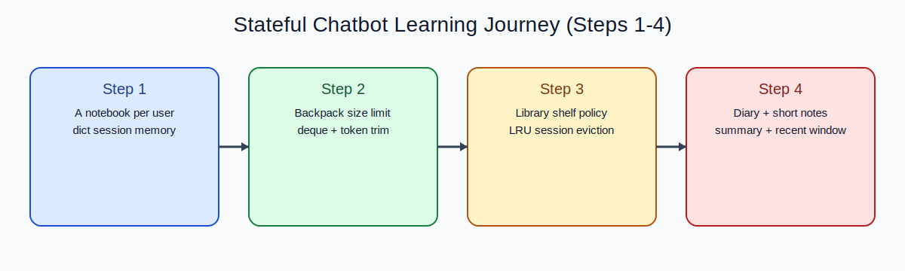
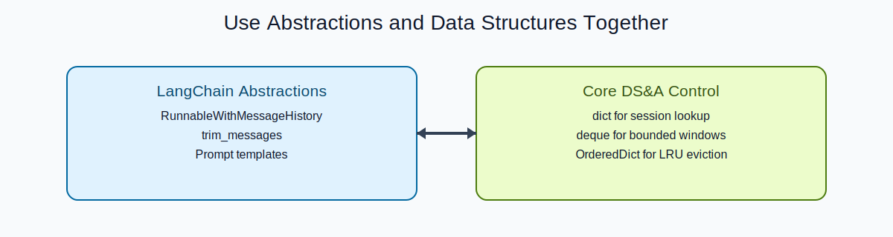

# Stateful Chatbot with LangChain (Python)

A structured learning repository for building a **stateful chatbot** with LangChain and Groq across **Steps 1-4**.

## Project Overview
This project teaches how chatbot memory evolves from a simple per-session message store to a multi-layer memory system with bounded windows, token trimming, LRU session eviction, and summary memory.

The scope is intentionally limited to **Phase A using RAM only, Steps 1-4**.

## Learning Objective
By the end of Step 4, you will understand how to design chatbot memory that is:
- session-aware
- bounded
- resource-conscious
- extendable toward persistent storage

## What “Stateful Chatbot” Means
A stateful chatbot includes relevant previous conversation context in each new model call, instead of treating every message as stateless.

## Why This Project Matters
Without memory controls, chat systems become expensive, slow, and unstable at scale. This project gives you practical memory architecture patterns before moving to databases or distributed backends.

## Tech Stack
- Python 3.11+
- [LangChain](https://python.langchain.com/)
- [Groq](https://console.groq.com/)
- `python-dotenv`
- `transformers` (required for token trimming support path)
- `uv` for environment + dependency management

## Repository Structure
```text
stateful-chatbot-langchain/
├── README.md
├── pyproject.toml
├── uv.lock
├── .python-version
├── .gitignore
├── .env.example
├── docs/
│   ├── architecture.md
│   └── memory-management.md
└── steps/
    ├── step1/
    │   ├── stateful_chatbot_step1.py
    │   └── README.md
    ├── step2/
    │   ├── stateful_chatbot_step2.py
    │   └── README.md
    ├── step3/
    │   ├── stateful_chatbot_step3.py
    │   └── README.md
    └── step4/
        ├── stateful_chatbot_step4.py
        └── README.md
```

## Installation (Clean Machine)

### 1) Clone and enter the repository
```bash
git clone <your-repo-url>
cd stateful-chatbot-langchain
```

### 2) Create the virtual environment with `uv`
```bash
uv venv
```

### 3) Activate the virtual environment
```bash
source .venv/bin/activate
```

### 4) Install dependencies with `uv`
```bash
uv sync
```

### 5) Deactivate the virtual environment
```bash
deactivate
```

### 6) Delete the virtual environment (if needed)
```bash
rm -rf .venv
```

### 7) Recreate it later
```bash
uv venv
source .venv/bin/activate
uv sync
```

## Environment Setup

### 1) Create `.env` from the example
```bash
cp .env.example .env
```

### 2) Add your Groq API key to `.env`
```env
GROQ_API_KEY=your_actual_groq_api_key
```

## Groq API Key Setup
1. Create a Groq account at [console.groq.com](https://console.groq.com/).
2. Generate an API key from your account settings.
3. Copy `.env.example` to `.env`.
4. Paste your own key into `.env` under `GROQ_API_KEY`.


## Running Each Step
From the project root:

```bash
uv run python steps/step1/stateful_chatbot_step1.py
uv run python steps/step2/stateful_chatbot_step2.py
uv run python steps/step3/stateful_chatbot_step3.py
uv run python steps/step4/stateful_chatbot_step4.py
```

## Steps 1-4 Summary
- **Step 1:** Basic per-session in-memory history (`dict` + `ChatMessageHistory`).
- **Step 2:** Bounded memory with deque window + token-budget trimming.
- **Step 3:** LRU session eviction with thread-safe in-memory store abstraction.
- **Step 4:** Prompt discipline + two-layer memory (`recent window + summary memory`).

## Memory Management Progression
- **Step 1:** Basic in-memory session state.
- **Step 2:** Bounded memory.
- **Step 3:** LRU session eviction + abstraction.
- **Step 4:** Prompt discipline + summary memory.

See [docs/memory-management.md](docs/memory-management.md).

## Step 1 to Step 4 as a Short Story
Imagine you are helping a librarian run a conversation desk:

- **Step 1:** Each visitor gets a personal notebook. You can now remember their earlier questions.
- **Step 2:** The notebook gets a size limit, and long pages are trimmed so the desk never overflows.
- **Step 3:** Shelf space is limited too, so notebooks not used recently are removed first (LRU policy).
- **Step 4:** You keep two memory layers: quick recent notes plus a compact summary of durable facts.



This is the core value of this repository: modern AI tooling is heavily abstracted, and it is easy to lose track of what controls memory behavior underneath. Here, you learn LangChain abstractions and DS&A control together:



## How to Study This Repository
- Open each step folder in order: `steps/step1` -> `steps/step2` -> `steps/step3` -> `steps/step4`.
- Read the corresponding `README.md` in each step before running the script.
- Implement each step yourself, line by line, instead of only executing the final files.
- Use the code as a reference to understand **when abstraction helps** and **when basic data structures and algorithms should enforce policy**.
- Keep notes on what changed between steps; that delta is the real learning output.
