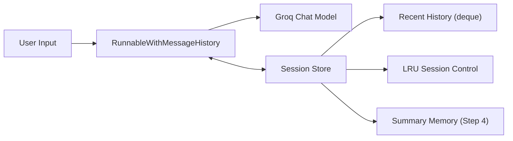

# Architecture (Steps 1-4)

## High-Level Evolution
1. Step 1 introduces session-scoped in-memory history.
2. Step 2 bounds per-session memory by message count and token budget.
3. Step 3 bounds total in-memory sessions using LRU eviction.
4. Step 4 separates short-term transcript memory from long-term summary memory.

## Step 1 Architecture
- Store: `dict[session_id -> ChatMessageHistory]`
- Behavior: fetch history, append user message, generate response, append response.

## Step 2 Architecture
- Store value switches to `deque(maxlen=2 * max_turns)`.
- Adds token trimming with `trim_messages()` to enforce context budget.

## Step 3 Architecture
- Global session store becomes thread-safe `OrderedDict`-based LRU.
- Evicts oldest session when `max_sessions_in_memory` is exceeded.

## Step 4 Architecture
Each session stores:
- `summary`: compressed long-term conversation memory.
- `recent`: bounded short-term transcript window.
- `turn_count`: used to trigger periodic summary refresh.

Prompt payload order:
1. System policy
2. Summary memory
3. Recent message history
4. New user input
